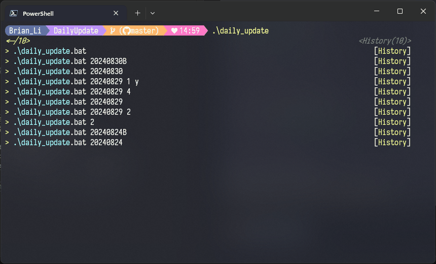

 


 


# 🕒SGS.OAD.DailyUpdate

- 將 LIMS 日常更新作業標準化，開發批次檔節省時間
- 指令盡可能符合 Windows 原生執行環境，減少執行異常
- 專案採分層設計，進行基本關注點分離，並符合部分 SOLID 原則
- 所有批次檔皆可獨立執行，方便進行單元開發、測試
- 包含多種歷程記錄方式 (建議安裝 `curl` 獲得完整體驗)



# 🗃️專案架構

```c
📁 Batches      //各步驟獨立批次檔
📁 Configs      //各種設定檔 (ini)
📁 Utils        //通用函式庫
📁 Logs         //歷程記錄 (執行後生成，不納入版控)
📄 backup_server.bat    //備份測試機
📄 daily_update.bat     //每日更新
📄 weekly_update.bat    //每週更新
```
- `📁Batches` 包含核心步驟批次檔 `*.bat`，皆可獨立執行、測試
- `📁Configs` 包含所有 `*.ini` 設定檔，依照屬性拆分，方便管理
- `📁Utils` 包含多個通用函式 `*.bat`，皆可獨立執行、測試
- `📄backup_server.bat` 備份伺服器資料 (可考慮用分支取代)
- `📄daily_update.bat` 每日更新主程序，拉取測試分支 `uat` 後更新測試機
- `📄weekly_update.bat` 每周更新主程序，拉取預設分支 `main` 後發布更新檔

>🚨注意 `📁Configs` 之中的 `📄personal.ini` 必須修改為個人電腦設定

# 🔄作業流程


# 🛠️ 如何使用

- 📝修改個人設定檔
- ▶️執行主程式
- ⚙️選擇執行模式

## 📝修改個人設定檔

- 開啟 `.\Configs\personal.ini`，修改為個人路徑

```ini
; 儲存庫路徑 (即 BLIMS 路徑)
REPO=C:\dev\BLIMS
; 發布路徑，專案進行發布後的檔案存放位置
PUB=C:\dev\somwhere\publish
```

## ▶️執行主程式

- 每日更新測試機，請執行 `daily_update.bat`
- 每週更新正式機，請執行 `weekly_update.bat`

>💡參數通常不用輸入，需要可參考檔頭說明，可能範例如下

```bash
# 更新版本 20240808B，並從步驟 2 開始執行
daily_update.bat "20240808B" 2
```

## ⚙️選擇執行模式

- 程式進行初始化後需選擇執行模式，可能會看到以下訊息

```bash
是否以 [安靜模式] 執行 y/n (預設 [詢問模式] 直接 Enter):
```

- 請參考畫面說明輸入 `y` 或 `n` 再按 `Enter`
- 或者直接 `Enter` 使用預設值

>💡[詢問模式] 可檢視步驟執行結果，判斷是否繼續執行或中斷作業，適合不熟悉流程的狀況下使用

# 🎉執行完成

- 主程式成功執行完畢後，系統會產生完成訊息
- 訊息會自動複製到剪貼簿，可回到 TEAMS 貼上，公告周知

# 🎥展示影片

- [每日更新](./asset/demo-daily.mp4)，指定版本 `yyyymmddB`，安靜模式執行，最後可於 Seq 檢視歷程
- [每周更新](./asset/demo-weekly.mp4)，預設資料確認後以安靜模式執行，最後開啟檔案總管確認